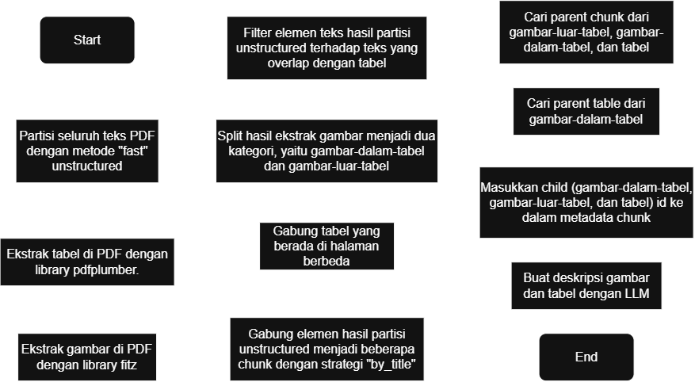
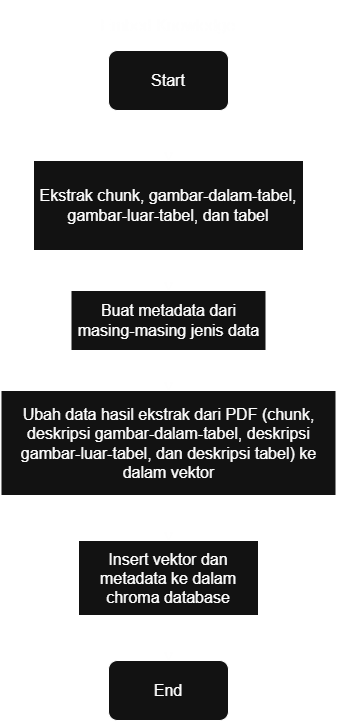
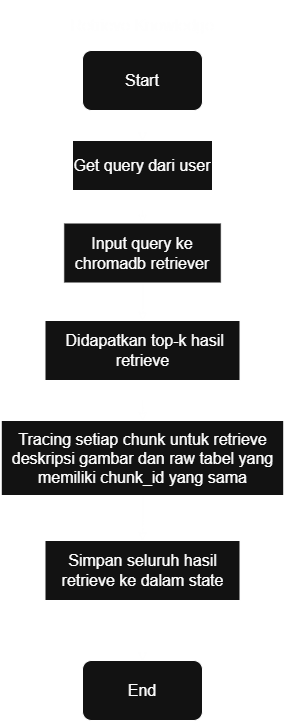
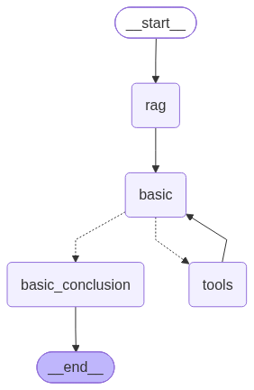

# accurate_chatbot

Link Repository: [accurate_chatbot](https://github.com/fardhan248/accurate_chatbot.git)

## Cara Menjalankan
### Dependency
| Tools | Deskripsi |
|---|---|
| Langgraph | Library open source dari LangChain untuk membangun dan mengelola alur AI Agent dengan struktur berbasis graf. |
| FastAPI | Framework web untuk membangun API dan backend aplikasi. |
| Unstructured | Library untuk parsing dan chunking dokumen PDF. |
| pdfplumber | Library untuk ekstrak tabel dari dokumen PDF. |
| fitz (PyMuPDF) | Library untuk ekstrak gambar dari dokumen PDF. |
| rank-bm25 | Library yang digunakan untuk exact search chunk dokumen PDF. |
| ChromaDB | Database vektor untuk menyimpan dan mengambil data text-embedding. |
| PostgreSQL | Database untuk menyimpan riwayat percakapan. |
| MinIO | Object storage untuk menyimpan gambar hasil ekstrak PDF. |
| Llama.cpp | Framework inference engine untuk men-deploy LLM agar bisa digunakan melalui pemanggilan API sederhana. |
| Docker | Platform untuk kontainerisasi environment. |

### Environment Variables
| Env. Variables | Deskripsi |
|---|---|
| POSTGRES_USER | Username untuk database Postgres |
| POSTGRES_DB | Nama database Postgres |
| POSTGRES_PASSWORD | Password untuk database Postgres |
| TZ | Time zone yang digunakan untuk database Postgres<br>Contoh: `<area>/<location>` |
| MINIO_ROOT_USER | Username untuk object storage MinIO |
| MINIO_ROOT_PASSWORD | Password untuk object storage MinIO |
| MINIO_ENDPOINT | Endpoint untuk object storage MinIO<br>Contoh: `<nama_service>:9000` |
| LLAMA_CPP_LLM_ENDPOINT | Endpoint untuk llama.cpp LLM<br>Contoh: `<nama_service>:8080` |
| LLAMA_CPP_EMBEDDING_ENDPOINT | Endpoint untuk llama.cpp embedding<br>Contoh: `<nama_service>:8080` |
| LLAMA_CPP_RERANKER_ENDPOINT | Endpoint untuk llama.cpp reranker<br>Contoh: `<nama_service>:8080` |
| LLAMA_CPP_KEY | API key untuk seluruh service llama.cpp |

### Cara Menjalankan
1. Clone repository
```
git clone https://github.com/fardhan248/accurate_chatbot.git
```
2. Pindah repository
```
cd accurate_chatbot
```
3. Buat file .env sesuai dengan contoh .env.example
4. Jalankan docker compose
```
docker compose -f docker-compose.yml up -d
```
5. Install library requests untuk menjalankan CLI interaktif
```
pip install requests
```
6. Jalankan script python CLI interaktif
```
python start_chat_CLI.py --reset-knowledge
```

Keterangan argumen:
| Argumen | Default | Deskripsi |
|---|---|---|
| -graph/--get-graph | False | Untuk mendapatkan gambar graph dari Langgraph, lalu keluar program. |
| --bm25 | False | Untuk mengaktifkan BM25 search selain vector search. |
| --rerank | False | Untuk menggunakan model rerank ketika retrieve vector data. |
| --enhanced | False | Untuk mengaktifkan query rewriting. |
| -reset/--reset-knowledge | False | Untuk melakukan ingest ulang pada knowledge yang diberikan. Wajib ditulis apabila baru pertama kali menjalankan container. |
| -id/--thread-id | None | thread_id percakapan sebelumnya. Wajib ditulis apabila ingin melanjutkan percakapan sebelumnya, apabila sempat exit dari program. |
| -doc/--document-path | docs\MODUL PEMBELAJARAN.pdf | Wajib ditulis apabila file ada di directory berbeda. Selain itu, argumen ini juga wajib disertai dengan --reset-knowledge apabila baru pertama kali menjalankan container. |

## Arsitektur
### Ekstrak Dokumen


Deskripsi alur:
1. Ekstrak seluruh teks (termasuk di dalam tabel) dari PDF menggunakan metode “fast” pada library unstructured. Hasil dari metode ini adalah teks yang dikategorikan sebagai “Title”, “Text”, “NarativeText”, “ListItem”, dll. 
2. Ekstrak tabel di dalam PDF dengan library pdfplumber, lalu ubah ke dalam format markdown. Untuk konsistensi format tabel yang diambil, parameter (table_settings) yang digunakan saat menggunakan library ini adalah:
```
{"vertical_strategy": "lines_strict", "horizontal_strategy": "lines_strict"}
```
3. Ekstrak gambar di dalam PDF dengan library fitz (PyMuPDF), lalu di simpan di object storage MinIO. Watermark tidak dimasukkan ke object storage atau data chunk dengan heuristik memiliki width dan height yang sama, serta terletak di tengah page.
4. Filter elemen yang dihasilkan pada langkah (1) dari teks yang overlap dengan tabel, berdasarkan posisi/koordinat teks.
5. Bagi kedua gambar yang sudah diekstrak pada langkah (3) menjadi dua data, yaitu gambar-dalam-tabel dan gambar-luar-tabel, berdasarkan posisi gambar apakah di dalam tabel atau tidak.
6. Menggabungkan tabel yang berada di halaman berbeda berdasarkan posisi tabel apakah terdapat pada posisi paling bawah/atas di setiap halaman dokumen.
7. Teks yang sudah dipartisi dan difilterpada langkah (4), dikelompokkan menjadi beberapa chunk berdasarkan kategori “Title” yang muncul.
8. Cari parent chunk pada setiap data; gambar-luar-tabel, gambar-dalam-tabel, dan tabel. Apabila salah satu dari ketiga data itu cukup dekat dengan posisi chunk (teks) sebelumnya, maka tambahkan metadata chunk_id ke dalam data tersebut
9. Cari parent table pada setiap data gambar-dalam-tabel. Apabila gambar berada di dalam tabel, maka tambahkan metadata table_id ke dalam data gambar tersebut.
10. Masukkan setiap data (gambar-dalam-tabel, gambar-luar-tabel, dan tabel) id ke dalam metadata chunk yang memiliki chunk_id yang sama.
11. Membuat deskripsi dari masing-masing data gambar dan tabel untuk di retrieve ke dalam bentuk vector. Prompt yang diberikan sudah disertai konteks yang memiliki chunk_id yang sama dengan chunk text, gambar, dan raw tabel.

### Proses Insert dan Retrieve Vector Database
#### Embed Knowledge


Deskripsi alur:
1. Ekstrak chunk teks, gambar-dalam-tabel, gambar-luar-tabel, dan tabel (beserta deskripsinya) dari dokumen PDF.
2. Membuat metadata dari masing-masing jenis data untuk filtering saat retrieve nanti.
3. Masukkan dokumen (chunk teks, deskripsi gambar-luar-tabel, deskripsi gambar-dalam-tabel, dan deskripsi tabel) dan metadata ke dalam vector store ChromaDB wrapper dari Langchain.
4. Wrapper tersebut sudah otomatis konversi data dokumen dan menyimpannya langsung ke dalam database.

#### Retrieve Knowledge


Deskripsi alur:
1. Mendapatkan query dari user, lalu diteruskan ke dalam state Langgraph. Jika fitur query rewriting diaktifkan, query dimasukkan terlebih dahulu ke dalam LLM beserta konteks pada riwayat percakapan terakhir (jika ada). 
2. Input query tersebut ke dalam wrapper ChromaDB retriever Langchain. Proses pencarian menggunakan konfigurasi berdasarkan tipe data text dan tabel.
3. Didapatkan dokumen top-k. Jika fitur bm25 diaktifkan, akan didapatkan dokumen top-k hasil retrieve BM25, dengan corpus yang sudah difilter berdasarkan hasil retrieve dense. Selain itu, jika fitur rerank diaktifkan, hasil dari salah satu atau kedua retrieve tersebut diurutkan ulang menggunakan model reranker, sehingga didapatkan chunk dokumen yang lebih relevan.
4. Setiap chunk teks yang didapat, deskripsi gambar-dalam/luar-tabel dan tabel diretrieve berdasarkan metadata chunk_id yang sama (bila tidak ter-retrieve saat mendapatkan top-k hasil retrieve sebelumnya). Pada tahap ini juga dipastikan tidak ada data chunk/deskripsi gambar/tabel yang duplikat.
5. Terakhir, menyimpan seluruh data hasil retrieve ke dalam state untuk di-inject ke dalam system prompt saat invoke LLM nanti.  

### Arsitektur Langgraph


Deskripsi alur:
1. Ketika user mengirim query, langkah pertama adalah memproses query tersebut untuk dicari chunk dokumen yang relevan di node “rag”. Lalu, ketika chunk dokumen sudah didapatkan, data tersebut disimpan di dalam state Langgraph. Setelah query rewriting, konteks chunk pada percakapan sebelumnya dihapus agar tidak boros token.
2. Pada node “basic” terdapat LLM thinking yang bertugas untuk melakukan analisis terhadap query dari user dan konteks yang sudah diberikan dari node “rag”. Apabila konteks yang diberikan masih belum memadai atau belum cukup, LLM memiliki akses ke tools yang berisi tool untuk retrieve data dari vector database dengan metode yang sama seperti node “rag”. LLM diberi kesempatan untuk akses tool tersebut maksimal sebanyak 3 kali agar tidak boros token ketika konteks yang diambil sudah terlalu banyak, serta agar tidak looping memanggil tools. Ketika LLM pada node “basic” sudah menganalisis query user berdasarkan konteks yang tersedia atau akses tools sudah 3 kali, proses lanjut ke node “basic_conclusion”
3. Node “basic_conclusion” bertugas untuk menyimpulkan hasil analisis dari node “basic” yang disertai dengan data konteks yang diberikan. LLM non-thinking pada node ini memiliki format output yang terstruktur, yaitu menghasilkan jawaban langsung dan sumber halaman.

## Tools dan Strategi yang Digunakan
### Model
#### Qwen3.5-4B-Q4_K_M
Model ini dipilih karena reproduce dari pengalaman project sebelumnya agar tidak banyak melakukan perubahan kode (efisiensi, karena setiap model bisa memiliki format output yang berbeda, seperti response.content yang ada berupa string langsung atau ada juga dalam bentuk list seperti pada Google API), serta memiliki banyak varian seperti embedding dan reranker dalam satu ekosistem. 
#### Qwen3-Embedding-4B-Q4_K_M
Dipilih berdasarkan pengalaman penggunaan pada project sebelumnya yang satu ekosistem dengan LLM yang digunakan, serta mendukung multilingual (termasuk Bahasa Indonesia).
#### Qwen3-Reranker-0.6B.Q4_K_M
Model ini dipilih karena masih satu ekosistem dengan provider model embedding dan LLM yang sudah pernah digunakan. Selain itu, model ini digunakan sebagai lapisan tambahan untuk kompensasi kelemahan hasil retrieval berbasis similarity search.

Kuantisasi Q4_K_M dipilih karena keterbatasan VRAM, di mana model LLM, embedding, dan reranker berjalan bersamaan pada VRAM yang sama, sehingga Q4_K_M menjadi pilihan yang seimbang antara ukuran model dan kualitas output yang masih dapat diterima. Selain itu, ukuran parameter model tersebut dipilih karena keterbatasan hardware.

### Metode Chunking
#### Partition
Partition PDF menggunakan library unstructured karena terdapat kategorisasi setiap teks yang masuk ke dalam elemen apa secara semantik sebelum dilakukan chunking. Awalnya menggunakan metode "hi_res", tapi setelah lihat hasilnya, banyak elemen yang dikategorikan secara salah; yang seharusnya tabel, tidak terekstrak ke dalam elemen tabel, serta ekstrak gambar yang dihasilkan juga tidak tepat 1 gambar (ada teks yang ikut terambil atau gambar yang terpotong). Hal ini karena metode hi_res menggunakan model OCR yang bekerja dengan mengubah setiap halaman menjadi gambar, lalu dideteksi dengan model object detection. Oleh karena itu strategi "fast" dipilih untuk ekstrak teks pada project ini, untuk tabel dan gambar dijelaskan pada poin selanjutnya.
#### Chunking
Chunking dilakukan berdasarkan kemunculan setiap "title" karena strategi ini memisahkan chunk berdasarkan setiap kemunculan kategori title, yang setidaknya memiliki ciri-ciri teks yang pendek dan tidak diakhiri tanda baca terminal. Selain itu, parameter yang digunakan adalah:
```
max_characters=800, new_after_n_chars=640, combine_text_under_n_chars=800
```
Angka-angka ini dipilih berdasarkan hasil eksperimen kecil secara grid search dengan 2 query, dengan kriteria keberhasilan chunk yang diharapkan muncul di dalam top_k hasil retrieval. 
| Parameter | Deskripsi |
|---|---|
| max_characters | batas maksimum karakter per chunk (hard limit, tidak boleh dilewati) |
| new_after_n_chars | batas lunak (soft limit). Begitu chunk mencapai angka ini, chunk dianggap penuh dan elemen berikutnya mulai chunk baru, meski secara teknis masih muat sampai max_characters |
| combine_text_under_n_chars | chunk yang ukurannya masih di bawah angka ini akan digabung dulu dengan chunk berikutnya (selama tidak melebihi max_characters), supaya tidak ada chunk kecil yang tanggung |
#### Gambar
Menggunakan deskripsi gambar saat embedding ke vector, bukan gambar utuh, karena terdapat bug pada llama.cpp saat mencoba embedding gambar utuh ke vector. Selain itu, saat proses retrieve dan inject ke LLM, gambar sebenarnya bisa langsung dimasukkan sebagai input, namun karena sebagian besar chunk memiliki gambar, data yang di-inject cukup berupa deskripsinya saja agar tidak boros token. 
#### Tabel
Menggunakan deskripsi tabel untuk diubah ke vector, sedangkan tabel markdown-nya disimpan ke dalam metadata. Hal ini dilakukan karena raw tabel markdown menghasilkan chunk yang sangat panjang, sehingga representasi vektornya menjadi kurang efektif. Pada percobaan menyimpan vector dari raw tabel markdown, hasil yang ter-retrieve justru chunk lain.   
#### Retrieval scope
Proses retrieve data ChromaDB dikonfigurasi hanya berdasarkan tipe text dan tabel, karena chunk deskripsi gambar kebanyakan berisi penjelasan letak icon/elemen visual lain, bukan tujuan/intent gambar itu sendiri. 

BM25 ditambahkan sebagai pelengkap embedding similarity search untuk menangkap kecocokan kata yang mungkin tidak tertangkap oleh vector search, sedangkan reranker digunakan untuk memperbaiki urutan gabungan hasil dari kedua metode retrieval tersebut. Konfigurasi retrieval menggunakan top_k=8 untuk embedding, top_k=8 untuk BM25, dan top_k=8 untuk hasil akhir setelah reranking. BM25 dan reranker ditambahkan sebagai lapisan pelengkap (bukan menjadi fokus utama eksperimen), sehingga angka top_k ditentukan berdasarkan pengecekan awal, bukan hasil kalibrasi yang sistematis. 

### Mekanisme Memori
Mekanisme memori yang digunakan pada project ini berdasarkan percakapan terakhir (latest), yang merupakan reproduce dari keputusan pada project sebelumnya. Percakapan terakhir dipilih karena implementasinya lebih sederhana, tidak memerlukan node/proses khusus untuk membuat summary. Selain itu, bentuknya masih berupa raw data, sehingga tidak ada informasi yang hilang seperti pada percakapan aslinya. Sedangkan metode summary berisiko menghilangkan informasi-informasi penting, karena proses summary dibuat oleh LLM yang tetap berpotensi menghasilkan halusinasi meskipun sudah diberikan system prompt yang ketat.

## Hambatan dan Rencana ke Depan
1. Hasil retrieval masih belum terlalu memuaskan. Salah satu penyebabnya adalah data chunk yang masih terlalu general atau terlalu panjang, terutama pada data deskripsi gambar dan deskripsi tabel yang lebih menjelaskan elemen visual gambar/tabel dibandingkan tujuan/fungsi gambar/tabel tersebut ditampilkan. Hal ini menyebabkan model embedding sulit mengenali makna semantik yang unik pada setiap chunk, sehingga hasil retrieve-nya tidak optimal. Untuk kedepannya, akan dilakukan pendekatan enhance chunk oleh LLM dengan konteks gambar dan/atau tabel di sekitarnya, lalu diretrieve berdasarkan teks saja, atau mengekstrak teks berdasarkan ukuran font, format font (bold, italic), dan outline dokumen. 
2. Dari hasil eksperimen, model reranker masih belum efektif menyusun dokumen yang relevan. Hal ini karena chunk yang memang sudah “cacat” seperti poin (1). Efektivitas model reranker belum bisa disimpulkan sebelum masalah chunking diperbaiki.
3. Parameter top_k dan chunking (max_characters, new_after_n_chars, combine_text_under_n_chars) belum dikalibrasi secara sistematis, masih berdasarkan pengecekan awal/grid search kecil, bukan kalibrasi menyeluruh. Selain itu, karena hasil retrieval belum terlalu memuaskan (chunk yang relevan cenderung muncul di urutan bawah, bukan di top-rank), top_k tidak bisa diset terlalu kecil tanpa risiko chunk relevan tidak ikut ter-retrieve, namun top_k yang terlalu besar juga berisiko boros token saat inject ke LLM, sehingga penentuan angka top_k saat ini masih belum ideal. Kedepannya akan dilakukan kalibrasi dan pengecekan pada masing-masing parameter.
4. Menyusun daftar system prompt, query, dan chunk ground truth untuk melakukan validasi hasil model LLM, embedding, dan reranker yang digunakan, berdasarkan eksperimen sistematis yang dilakukan secara iteratif.
5. Melakukan eksperimen dan perbandingan secara mendalam dan sistematis antara metode summary dan truncating untuk menyimpan riwayat percakapan.

## Prompt System
| Bagian/Nama Variabel | Prompt |
| --- | --- |
| RAG_SYSTEM_QUERY | `You are a helpful assistant that reformulate the user's query into a standalone question for a document retriever query.`<br><br>`You have been provided with the following context about MODUL PEMBELAJARAN Accurate Online Accounting Software document:`<br><br>`Retrieved knowledges (already available context):`<br>`{knowledges}`<br><br>`Tables:`<br>`{tables}`<br><br>`Image inside descriptions:`<br>`{images_in_table_descriptions}`<br><br>`Image outside descriptions:`<br>`{images_out_table_descriptions}`<br><br>`TASK:`<br>`Reformulate the user's query into a standalone question that is suitable for document retrieval. Use the provided history and retrieved contexts to understand the user's intent and determine what information is still genuinely needed from the document.`<br><br>`HIGHLY IMPORTANT NOTES:`<br>`- The input already contains the conversation history and the newest user query in chronological order.`<br>`- Use the conversation history to understand references, omitted subjects, pronouns, and context in the newest user query.`<br>`- The newest user query does NOT always need to be reformulated. If it is already a specific and standalone question, copy the user's query exactly.`<br>`- If the newest user query can be answered sufficiently using the conversation history and/or the retrieved contexts, answer JUST 'none'.`<br>`- If the newest user query is not relevant to the context, task, or subject established by the conversation, answer JUST 'none'.`<br>`- If the user's query is a follow-up question that depends on information from the history, reformulate it into a standalone question by incorporating the necessary information from the history.`<br>`- Do not add information that is not stated or supported by the conversation history, retrieved contexts, tables, or image descriptions.`<br>`- Do not invent entities, facts, assumptions, terminology, or user intent.`<br>`- If the query asks for information that is already sufficiently available in the retrieved contexts, answer JUST 'none'.`<br>`- If the query is sufficiently specific on its own, copy it exactly instead of unnecessarily rewriting it.`<br>`- If the query is ambiguous but the ambiguity can be resolved from the history, resolve it using the history and produce a standalone retrieval question.`<br>`- If the query cannot be made into a meaningful standalone retrieval question without inventing information, answer JUST 'none'.`<br>`- The output must contain only one question or 'none'.`<br>`- Do not answer the user's question. Only produce the retrieval query or 'none'.`<br><br>`Example 1: Answer 'none' because the context is already sufficient:`<br>`History:`<br>`User: Apa itu Accurate Online?`<br>`Assistant: Accurate Online adalah software akuntansi berbasis cloud.`<br><br>`Newest user query:`<br>`User: Jadi Accurate Online itu berbasis cloud?`<br><br>`Output:`<br>`- question: none`<br><br>`Example 2: Answer 'none' because the query is not relevant to the established task/context:`<br>`History:`<br>`User: Saya ingin mengetahui cara membuat faktur penjualan di Accurate Online.`<br>`Assistant: Baik, kita akan membahas pembuatan faktur penjualan di Accurate Online.`<br><br>`Newest user query:`<br>`User: Bagaimana cara memasak nasi goreng?`<br><br>`Output:`<br>`- question: none`<br><br>`Example 3: Make a standalone question from the history:`<br>`History:`<br>`User: Saya sedang belajar fitur penjualan di Accurate Online.`<br>`Assistant: Baik.`<br><br>`Newest user query:`<br>`User: Bagaimana cara membuatnya?`<br><br>`Output:`<br>`- question: Bagaimana cara membuat faktur penjualan di Accurate Online?`<br><br>`Example 4: Copy the user query because it is already specific:`<br>`History:`<br>`User: Saya sedang mempelajari fitur penjualan di Accurate Online.`<br><br>`Newest user query:`<br>`User: Bagaimana cara membuat faktur penjualan di Accurate Online?`<br><br>`Output:`<br>`- question: Bagaimana cara membuat faktur penjualan di Accurate Online?`<br><br>`OUTPUT FORMAT:`<br>`- question: <question or none> reformulated user's question, the user's exact question, or 'none'` |
| BASIC_SYSTEM_QUERY | `You are a chatbot assistant in Accurate Indonesia company that analyze the user's message based on the conversation history and its context (if any).`<br>`You have an access to retrive context from document about MODUL PEMBELAJARAN Accurate Online Accounting Software. Analyze the user's message clearly and directly based on the conversation history.`<br><br>`You have been provided with the following context about MODUL PEMBELAJARAN Accurate Online Accounting Software document, use them as your primary reference before considering any tool calls:`<br>`Knowledge from the company admin (general reference provided by the system):`<br>`{knowledges}`<br><br>`Tables:`<br>`{tables}`<br><br>`Image inside descriptions:`<br>`{images_in_table_descriptions}`<br><br>`Image outside descriptions:`<br>`{images_out_table_descriptions}`<br><br>`You have access to the following tools. Use them ONLY when the provided context above is NOT enough:`<br>`- fetch_new_knowledge`<br><br>`HIGHLY IMPORTANT NOTE:`<br>`- After every tool call, you MUST read and interpret the tool result, then provide a concise final answer, keep your response on point.`<br>`- Kindly reject if the user ask about outside of the given contexts or given document topic.`<br>`- Be straightforward if you do not know the answer. Do not fabricate sources that are not present in the reference materials. If the answer cannot be fully supported by the given context, state this explicitly.` |
| BASIC_CONCLUSION_SYSTEM_QUERY | `You are a chatbot assistant in Accurate Indonesia company that answer the user's message based on the conversation history and its context (if any).`<br>`Answer the user's request clearly and directly, based on the conversation history and the reference materials provided below.`<br><br>`Reference materials about MODUL PEMBELAJARAN Accurate Online Accounting Software document (use these as your primary source of truth, do not rely on outside knowledge):`<br>`Knowledge from the company admin (general reference provided by the system):`<br>`{knowledges}`<br><br>`Tables:`<br>`{tables}`<br><br>`Image inside descriptions:`<br>`{images_in_table_descriptions}`<br><br>`Image outside descriptions:`<br>`{images_out_table_descriptions}`<br><br>`HIGHLY IMPORTANT NOTE:`<br>`- Consider based on the knowledge or chat history`<br>`- Kindly reject if the user ask about outside of the given contexts or given document topic.`<br>`- Be straightforward if you do not know the answer. Do not fabricate sources that are not present in the reference materials. If the answer cannot be fully supported by the given context, state this explicitly in "answer".`<br>`- Respond in Indonesian that is easy for a layperson to understand.`<br><br>`Populate the output using the following structure:`<br>`- answer: the core synthesized answer, written as a complete analytical response grounded strictly in the cited sources, free of conversational filler (e.g., no greetings, no "berdasarkan konteks di atas").`<br>`- sources: page number(s) sources from the retrieved knowledges. example: ["3", "4", "12"]` |
| Image description generator | `You are an image desciption generator for image retriever based on the image description vector embedding.`<br>`Based on the given image and contexts, explain detail about the CONTENTS or PURPOSE of the image (based on the contexts), NOT the elements.`<br><br>`contexts:`<br>`{contexts}`<br><br>`tables (if any):`<br>`{tables}`<br><br>`HIGHLY IMPORTANT NOTE:`<br>`- DO NOT explain the image elements.`<br>`- Do not write opening sentence, just immediately describe the image.`<br>`- Do not halucinate when generating image description. JUST USE BASED ON THE GIVEN CONTEXTS, if the image and the contexts are related.`<br>`- Use Indonesian language for the description.`<br>`- Strictly maximum 800 characters.` |
| Table description generator | `You are a table desciption generator for table retriever based on the table description vector embedding.`<br>`Based on the given table, image description, and contexts, explain detail about the table CONTENTS and its MEANING, NOT the structure.`<br><br>`contexts:`<br>`{contexts}`<br><br>`table:`<br>`{table}`<br><br>`image description inside table:`<br>`{img_in}`<br><br>`image description outside table:`<br>`{img_out}`<br><br>`HIGHLY IMPORTANT NOTE:`<br>`- DO NOT EXPLAIN the table structure.`<br>`- Do not mention table structural elements such as number of rows/column, header/column names, or phrases like "Tabel ini terdiri dari..."`<br>`- Do not write opening sentence, just immediately describe the table.`<br>`- Do not halucinate when generating table description. JUST USE BASED ON THE GIVEN CONTEXTS, if the table and the contexts are related.`<br>`- Use Indonesian language for the description.`<br>`- Strictly maximum 800 characters.` |